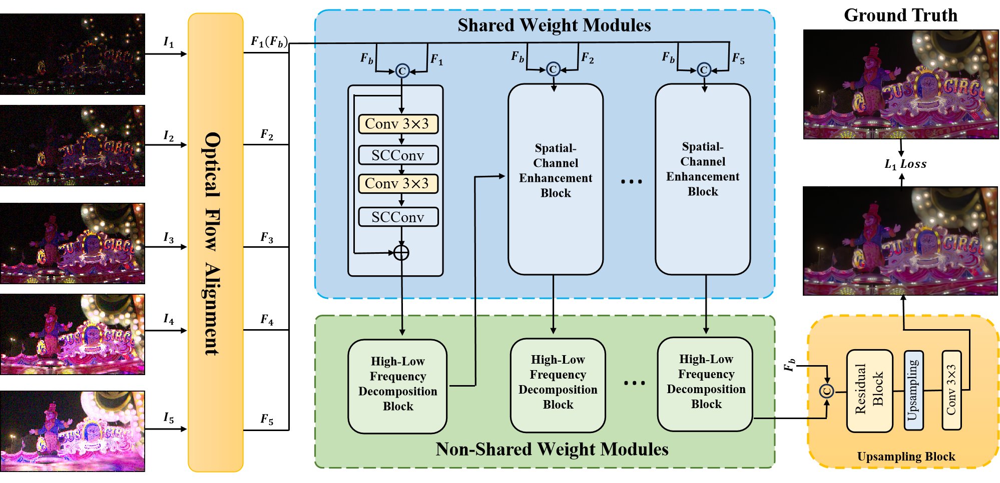
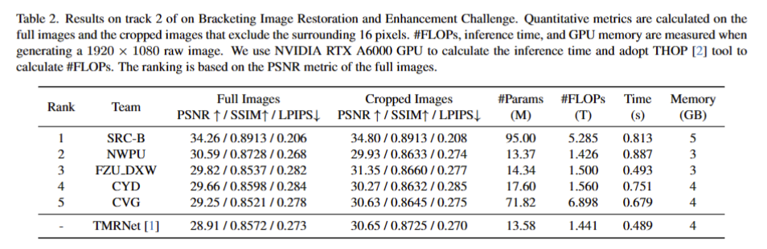
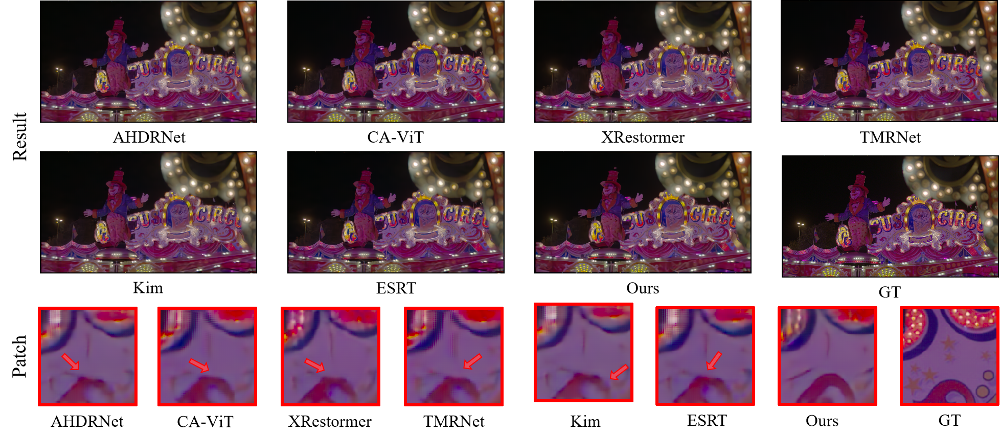
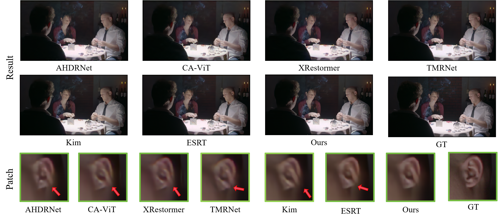
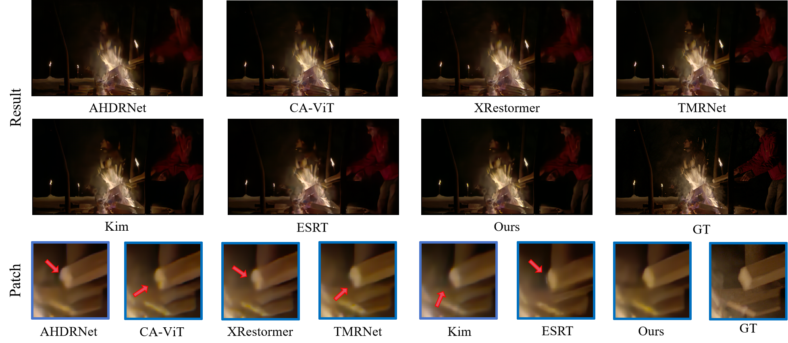

# HLNet
 HLNet, which secured fourth place in the NTIRE 2024 Challenge on Bracketing Image Restoration and Enhancement - Track 2 BracketIRE+ Task, has now been accepted by the CVPR 2024 Workshop.

## 1. Abstract

In real-world scenarios, due to a series of image degradations, obtaining high-quality, clear content photos is challenging. While significant progress has been made in synthesizing high-quality images, previous methods for image restoration and enhancement often overlooked the characteristics of different degradations. They applied the same structure to address various types of degradation, resulting in less-than-ideal restoration outcomes. Inspired by the notion that high/low frequency information is applicable to different degradations, we introduce HLNet, a Bracketing Image Restoration and Enhancement method based on high-low frequency decomposition. Specifically, we employ two modules for feature extraction: shared weight modules and non-shared weight modules. In the shared weight modules, we use SCConv to extract common features from different degradations. In the non-shared weight modules, we introduce the High-Low Frequency Decomposition Block (HLFDB), which employs different methods to handle high-low frequency information, enabling the model to address different degradations more effectively. Compared to other networks, our method takes into account the characteristics of different degradations, thus achieving higher-quality image restoration.

## 2. Overview of CRNet

<p align="center"></p>

## 3. Comparison of other methods in track 1 of the Bracketing Image Restoration and Enhancement Challenge.

<p align="center"></p>

## 4. Expample Result

<p align="center"></p>
<p align="center"></p>
<p align="center"></p>

## 5.Citation
```
@inproceedings{,
 
}
```

## Contact
If you have any questions, feel free to contact Genggeng Chen at chengeng0613@gmail.com.
